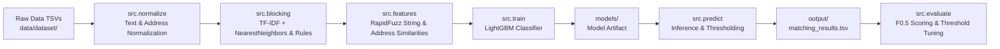

# Business Entity Resolution ML Pipeline

An end-to-end entity resolution and record deduplication framework engineered for high-precision business record matching. This pipeline scales matching across large datasets by combining sub-quadratic candidate generation (TF-IDF vector indexing with scikit-learn's `NearestNeighbors`), rich pairwise feature engineering (RapidFuzz string similarities, address/phone heuristics), a gradient-boosted decision tree classifier (LightGBM), and precision-oriented $F_{0.5}$ evaluation.

---

## 📂 Project Structure

```text
business_entity_resolution/
├── data/                  # (gitignored) train/ and test/ TSVs go here
│   ├── dataset/
│   │   ├── train/         # Training split TSVs
│   │   └── test/          # Test split TSVs
├── output/                # Generated matching_results.tsv and candidate_pairs.tsv land here
├── models/                # Trained model checkpoints & artifacts (gitignored)
├── src/
│   ├── __init__.py        # Package initialization
│   ├── config.py          # Paths, global constants, and RANDOM_SEED = 42
│   ├── normalize.py       # Text, business name, address, and phone normalization
│   ├── blocking.py        # Candidate pair generation (TF-IDF + NearestNeighbors & rules)
│   ├── features.py        # Pairwise feature engineering (RapidFuzz string similarities)
│   ├── train.py           # LightGBM classifier training with stratified validation
│   ├── predict.py         # Inference: score candidate pairs, apply threshold, write outputs
│   ├── evaluate.py        # Model evaluation with F0.5 scoring on validation splits
│   └── eda.py             # Exploratory Data Analysis & visual noise inspection
├── requirements.txt       # Pinned library dependencies
├── .gitignore             # Standard ML ignore rules for data, models, and outputs
└── README.md              # Pipeline documentation and usage instructions
```

---

## ⚙️ Installation & Setup

1. **Clone or navigate to the project directory:**
   ```bash
   cd business_entity_resolution
   ```

2. **Create and activate a Python virtual environment (Python 3.10+ recommended):**
   ```bash
   python3 -m venv .venv
   source .venv/bin/activate
   ```

3. **Install pinned dependencies:**
   ```bash
   pip install -r requirements.txt
   ```

---

## 🧩 Pipeline Architecture



1. **Normalization (`src/normalize.py`)**: Cleans business names, removes corporate legal suffixes (`Inc`, `LLC`, `Corp`), standardizes street types (`Street` $\to$ `st`), and canonicalizes phone numbers.
2. **Blocking Layer (`src/blocking.py`)**: Uses character n-gram `TfidfVectorizer` paired with `NearestNeighbors` (cosine metric) alongside exact rule partition keys (e.g., postal code) to trim the $O(N^2)$ pair space down to high-probability candidates.
3. **Feature Engineering (`src/features.py`)**: Extracts multi-attribute similarity signals:
   - RapidFuzz: Levenshtein ratio, Jaro-Winkler, token sort ratio, token set ratio.
   - Address & location: Street number equality, street name similarity, postal code matches.
   - Contact signals: Phone digit equality, last-4 digit match.
4. **Training (`src/train.py`)**: Trains an `LGBMClassifier` using stratified splits with reproducible seed (`RANDOM_SEED = 42`).
5. **Inference (`src/predict.py`)**: Computes match probabilities for candidate pairs, applies decision thresholds, and writes outputs to `output/matching_results.tsv`.
6. **Evaluation (`src/evaluate.py`)**: Computes $F_{0.5}$ metric (weighting precision twice as heavily as recall to avoid false positive business merges) and identifies optimal decision cutoffs.

---

## 🚀 CLI Usage Guide

Each stage provides a standalone command-line entrypoint using `argparse`. Execute from the `business_entity_resolution` directory:

### 1. Normalization
```bash
# Normalize training split
python -m src.normalize --split train

# Normalize test split
python -m src.normalize --split test
```

### 2. Candidate Generation (Blocking)
```bash
# Generate candidate pairs for training data
python -m src.blocking --split train --k-neighbors 20 --max-distance 0.6

# Generate candidate pairs for test data
python -m src.blocking --split test --k-neighbors 20 --max-distance 0.6
```

### 3. Pairwise Feature Engineering
```bash
# Compute pairwise features for training candidate pairs
python -m src.features --split train --pairs-path output/candidate_pairs.tsv

# Compute pairwise features for test candidate pairs
python -m src.features --split test --pairs-path output/candidate_pairs.tsv
```

### 4. Model Training
```bash
# Train LightGBM classifier and save checkpoint to models/
python -m src.train \
  --features-path output/train_features.tsv \
  --model-output-path models/lgbm_entity_resolution.joblib \
  --val-size 0.2
```

### 5. Inference / Prediction
```bash
# Score test candidate pairs and output matching results
python -m src.predict \
  --split test \
  --model-path models/lgbm_entity_resolution.joblib \
  --candidates-path output/candidate_pairs.tsv \
  --threshold 0.5 \
  --output-path output/matching_results.tsv
```

### 6. Validation Evaluation ($F_{0.5}$ Scoring)
```bash
# Evaluate predictions with F0.5 score and sweep for optimal decision cutoff
python -m src.evaluate \
  --predictions-path output/matching_results.tsv \
  --ground-truth-path data/dataset/val_ground_truth.tsv \
  --beta 0.5 \
  --optimize-threshold
```

### 7. Exploratory Data Analysis (EDA)
```bash
# Analyze sources, match provenance, side-by-side noise, and save histograms to output/eda/
python -m src.eda
```

---

## 🎯 Reproducibility & Constants

All configurations, file paths, and hyperparameters are centralized in [`src/config.py`](file:///Users/ravi/amazon%20ml/business_entity_resolution/src/config.py):
- `RANDOM_SEED = 42`: Fixed seed applied across Python `random`, `numpy`, scikit-learn, and LightGBM.
- `EVAL_F_BETA = 0.5`: The $F_{0.5}$ metric prioritizes precision over recall:
  $$F_{0.5} = (1 + 0.5^2) \frac{\text{Precision} \cdot \text{Recall}}{0.5^2 \cdot \text{Precision} + \text{Recall}} = \frac{1.25 \cdot \text{Precision} \cdot \text{Recall}}{0.25 \cdot \text{Precision} + \text{Recall}}$$
